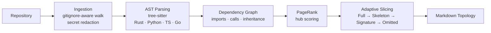

# RepoItDown

**AST-aware codebase topology for LLM context windows.**

[](https://github.com/byte271/RepoItDown/actions/workflows/ci.yml)
[](LICENSE)
[](Cargo.toml)

> **Status:** early alpha (`v0.1.0`). Interfaces and output format may still change between releases.

Feeding an LLM your codebase usually means one of two bad options: hand-pick a few files and hope you grabbed the right ones, or dump everything and burn the context window on boilerplate, fixtures, and vendored code. RepoItDown takes a third path. It parses your code with tree-sitter, builds a dependency graph of how symbols actually call and import each other, ranks architectural importance with PageRank, and then spends your token budget where it matters — full source for the files holding the codebase together, compressed skeletons or bare signatures for everything else, and nothing at all for what doesn't fit.

## Table of Contents

- [Features](#features)
- [How It Works](#how-it-works)
- [Installation](#installation)
- [Usage](#usage)
  - [CLI](#cli)
  - [MCP Server](#mcp-server)
  - [REST API](#rest-api)
  - [Python SDK](#python-sdk)
  - [TypeScript SDK](#typescript-sdk)
  - [Dependency Graph Visualizer](#dependency-graph-visualizer)
- [Example Output](#example-output)
- [Project Layout](#project-layout)
- [Development](#development)
- [License](#license)

## Features

- **AST-aware, not line-based** — real tree-sitter grammars for Rust, Python, TypeScript, and Go extract functions, classes, structs, interfaces, and imports; every other language falls back to a regex-based skeletonizer.
- **Code Dependency Graph + PageRank** — builds a directed graph of imports, calls, and inheritance, then runs PageRank to find the files that actually hold the architecture together.
- **Four processing modes** — `dump`, `explore`, `architect`, and `task`, from "just give me everything" to "only what's relevant to this one change."
- **Token-budget-aware slicing** — a fractional-knapsack allocator degrades each file through four levels (Full → Skeleton → Signature → Omitted) to fit a hard token ceiling, protecting architectural hubs as it goes.
- **BM25 task targeting** — describe what you're working on in plain English and `task` mode pulls in the relevant files at full resolution, plus their nearest dependencies.
- **Secret redaction** — scans for OpenAI/GitHub/AWS/Stripe keys, JWTs, private keys, and DB connection strings, redacts them, and flags affected files in the output.
- **Five ways in** — CLI, MCP server (Claude Desktop / Cursor / Windsurf), REST API, Python SDK, and TypeScript SDK, all built on the same `repoitdown-core` engine.
- **Interactive graph visualizer** — a standalone D3.js force-graph viewer for exploring the dependency graph your codebase produces.

## How It Works



1. **Ingestion** — walks the repo respecting `.gitignore`, skips oversized files, and redacts anything that looks like a secret.
2. **AST Parsing** — tree-sitter extracts functions, types, and imports per file (regex fallback for unsupported languages).
3. **Code Dependency Graph** — every exported symbol becomes a node; imports, calls, and inheritance become edges.
4. **PageRank** — scores each node by centrality (damping `0.85`, up to `100` iterations, convergence `1e-6`); the top decile becomes "hub" files.
5. **Adaptive Slicing** — a fractional-knapsack allocator spends the token budget on the highest-value files first, degrading everything else through Full → Skeleton → Signature → Omitted.
6. **Render** — assembled into one Markdown document: a structural summary table, an optional Contract View of exported symbols, and the (possibly sliced) source itself.

### Processing modes

| Mode | What you get | Needs `--max-tokens`? |
|---|---|---|
| `dump` | Full source, every file. No graph, no slicing. *(default)* | No |
| `explore` | Full source **+** a Contract View listing every exported symbol | No |
| `architect` | Every file skeletonized except PageRank hubs, which stay in full | For a bounded budget |
| `task` | BM25-matched target files in full, their dependencies skeletonized, the rest degraded or dropped | For a bounded budget |

### Slice levels

| Level | Contents |
|---|---|
| `Full` | Verbatim source |
| `Skeleton` | Signatures + imports; bodies replaced with a language-correct placeholder (`/* ... */` in Rust, `...` in Python) |
| `Signature` | Just the symbol's name, kind, and location — no body |
| `Omitted` | File dropped from the output entirely |

Hub files are protected from degrading past `Skeleton`, so the architectural core of the repo never disappears, even under a tight budget.

## Installation

Every interface below is built from this Cargo workspace.

**Prerequisites**
- Rust 1.85+ (2024 edition) — the CLI, MCP server, REST server, and Python extension are all Rust binaries/libraries
- Python 3.9–3.13 — only needed for the Python SDK, built via [maturin](https://www.maturin.rs/)
- Node.js 18+ — only needed for the TypeScript SDK

### Build the Rust binaries

```bash
git clone https://github.com/byte271/RepoItDown.git
cd RepoItDown
cargo build --release --workspace
```

| Binary | Crate | Purpose |
|---|---|---|
| `repoitdown` | `repoitdown-cli` | Command-line interface |
| `repoitdown-mcp` | `repoitdown-mcp` | MCP server (stdio transport) |
| `repoitdown-server` | `repoitdown-server` | REST API server |

Put them on your `PATH`:

```bash
cargo install --path crates/repoitdown-cli
cargo install --path crates/repoitdown-mcp
cargo install --path crates/repoitdown-server
```

### Python SDK

```bash
cd sdks/python
pip install maturin
maturin develop --release
```

### TypeScript SDK

The SDK spawns the `repoitdown` binary as a subprocess — build the CLI first (above), then:

```bash
cd sdks/typescript
npm install
npm run build
```

### Dependency graph visualizer

A single static HTML file — no build step. Open `sdks/visualizer/index.html` directly in a browser, or serve it:

```bash
python3 -m http.server --directory sdks/visualizer 8000
```

## Usage

### CLI

```
repoitdown <PATH> [OPTIONS]
```

| Flag | Description |
|---|---|
| `<PATH>` | Repository to analyze (required, positional) |
| `-m, --mode <MODE>` | `dump` \| `explore` \| `architect` \| `task` — see [modes](#processing-modes) (default: `dump`) |
| `--max-tokens <N>` | Output token ceiling; also the slicing budget for `architect`/`task` |
| `--query <TEXT>` | Free-text query — required when `--mode task` |
| `-o, --output <PATH>` | Write to a file instead of stdout |
| `--no-collapse` | Plain Markdown instead of collapsible `<details>` blocks |
| `-v, --verbose` | Debug diagnostics on stderr |

```bash
# Full source, straight to a file
repoitdown . --mode dump --output full.md

# Full source + a Contract View of every exported symbol
repoitdown . --mode explore

# Architectural overview, capped at 8k tokens
repoitdown . --mode architect --max-tokens 8000

# Only what's relevant to one task, capped at 4k tokens
repoitdown . --mode task --query "fix auth token expiration" --max-tokens 4000 -o context.md
```

### MCP Server

`repoitdown-mcp` speaks [MCP](https://modelcontextprotocol.io/) over stdio and exposes a single tool:

```
get_codebase_topology(repo_path, mode="dump", query=None, max_tokens=None)
```

Ready-made client configs live in [`configs/`](configs/); all three look like this:

```json
{
  "mcpServers": {
    "repoitdown": {
      "name": "RepoItDown",
      "description": "AST-aware codebase topology for LLM context windows",
      "command": "repoitdown-mcp",
      "args": []
    }
  }
}
```

| Client | Config file |
|---|---|
| Claude Desktop | macOS: `~/Library/Application Support/Claude/claude_desktop_config.json` · Windows: `%APPDATA%\Claude\claude_desktop_config.json` |
| Cursor | `~/.cursor/mcp.json` (global) or `.cursor/mcp.json` (per-project) |
| Windsurf | `~/.codeium/windsurf/mcp_config.json` |

Restart the client after editing its config. Make sure `repoitdown-mcp` is on your `PATH` (see [Installation](#installation)).

### REST API

```bash
repoitdown-server              # listens on :8080 by default
PORT=3000 repoitdown-server    # override via the PORT env var
```

| Method | Path | Description |
|---|---|---|
| `GET` | `/health` | Liveness probe |
| `POST` | `/api/v1/topology` | Run the pipeline, return the topology as JSON |

```bash
curl -X POST http://localhost:8080/api/v1/topology \
  -H "Content-Type: application/json" \
  -d '{"repo_path": ".", "mode": "architect", "max_tokens": 8000}'
```

```json
{
  "output": "# RepoItDown — Repository Topology\n\n**42 files · 7981 tokens · 116 symbols**\n...",
  "files": 42,
  "tokens": 7981
}
```

### Python SDK

```python
from repoitdown import RepoItDown

rd = RepoItDown()

# Architectural overview, capped at 8k tokens
output = rd.run(".", mode="architect", max_tokens=8000)

# Task-guided
output = rd.run(".", mode="task", query="fix auth token expiration")

# Export the Code Dependency Graph as JSON (for the visualizer, or your own tooling)
graph_json = rd.export_graph(".")
```

### TypeScript SDK

```ts
import { repoitdown, repoitdownToString } from 'repoitdown';

const { output, exitCode } = await repoitdown({
  repoPath: '.',
  mode: 'architect',
  maxTokens: 8000,
});

// or, if you just want the string and are fine with it throwing on failure:
const output2 = await repoitdownToString({ repoPath: '.', mode: 'dump' });
```

> A native Node addon (napi-rs) is planned to cut out the subprocess-spawn overhead; today's SDK shells out to the `repoitdown` binary, so it must be on your `PATH` (or passed via `binaryPath`).

### Dependency Graph Visualizer

Export a graph, then load the JSON into `sdks/visualizer/index.html`:

```python
from repoitdown import RepoItDown

with open("graph.json", "w") as f:
    f.write(RepoItDown().export_graph("."))
```

The viewer is a force-directed D3.js graph — node radius and color encode PageRank score, drag nodes to rearrange, scroll to zoom. The underlying JSON shape:

```json
{
  "nodes": [
    { "id": 0, "name": "run", "file": "src/lib.rs", "kind": "function", "score": 0.183 }
  ],
  "edges": [
    { "source": 0, "target": 1, "kind": "call" }
  ],
  "node_count": 1,
  "edge_count": 1
}
```

Edge `kind` is one of `import`, `call`, `extends`, `implements`, or `interface_extends`.

## Example Output

Running `repoitdown . --mode explore` on a small project produces a single Markdown document:

`````markdown
# RepoItDown — Repository Topology

**3 files · 1,204 tokens · 9 symbols**

## Structural Summary

| Directory | Files | Tokens |
|-----------|-------|--------|
| `src` | 3 | 1,204 |
| **Total** | **3** | **1,204** |

## Contract View

### `src/lib.rs`
- `fn` **run** — entry point for the pipeline
- `struct` **Config**

## Source Files

<details>
<summary><code>src/lib.rs</code> <em>rust · 812 tokens</em></summary>

```rust
pub fn run(cfg: &Config) -> Result<()> {
    // ...
}
```

**Extracted Symbols:**

- L1: `fn` **run**
- L5: `struct` **Config**

</details>
`````

Each source file collapses into its own `<details>` block — expand the ones you care about, skim the rest. Files with detected secrets are flagged inline with ⚠️.

## Project Layout

```
RepoItDown/
├── crates/
│   ├── repoitdown-core/     # the engine: ingestion, AST, graph, slicing, rendering
│   │   └── src/
│   │       ├── ingestion/    # gitignore-aware walker + secret redaction
│   │       ├── ast/          # tree-sitter extractors (rust, python, typescript, go, fallback)
│   │       ├── graph/        # Code Dependency Graph + PageRank
│   │       ├── slicing/      # BM25, skeletonizer, fractional-knapsack allocator
│   │       ├── output/       # Markdown rendering
│   │       └── tokenizer/    # token counting
│   ├── repoitdown-cli/       # `repoitdown` binary
│   ├── repoitdown-mcp/       # `repoitdown-mcp` — MCP server
│   ├── repoitdown-server/    # `repoitdown-server` — REST API (axum)
│   └── repoitdown-py/        # PyO3 bindings
├── sdks/
│   ├── python/                # pip-installable wrapper (maturin)
│   ├── typescript/            # npm package, wraps the CLI binary
│   └── visualizer/            # standalone D3.js dependency graph viewer
├── configs/                    # ready-made MCP client configs
└── Cargo.toml                  # workspace manifest
```

## Development

```bash
cargo fmt --all --check                     # formatting
cargo clippy --workspace -- -D warnings     # lint, warnings as errors
cargo build --workspace                     # build everything
cargo bench --no-run -p repoitdown-core     # benchmarks compile
cargo test --workspace                      # run the test suite
```

This mirrors the [CI workflow](.github/workflows/ci.yml) exactly. `repoitdown-core` forbids `unsafe` code (`#![forbid(unsafe_code)]`); the only `unsafe` in the workspace is scoped to `repoitdown-cli`'s tree-sitter grammar FFI bindings.

Built on [tree-sitter](https://tree-sitter.github.io/tree-sitter/), [petgraph](https://github.com/petgraph/petgraph), [tiktoken-rs](https://github.com/zurawiki/tiktoken-rs), [axum](https://github.com/tokio-rs/axum), [PyO3](https://pyo3.rs/), and [D3.js](https://d3js.org/).

## License

Apache License 2.0 — see [LICENSE](LICENSE).
